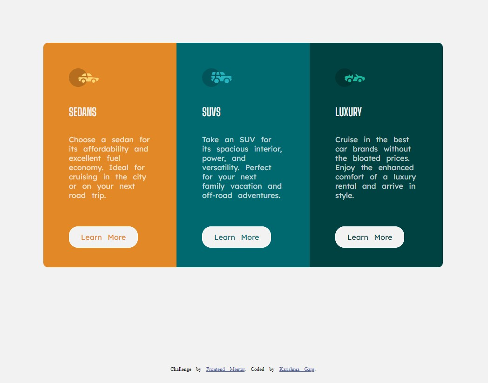

# Frontend Mentor - 3-column preview card component solution

This is a solution to the [3-column preview card component challenge on Frontend Mentor](https://www.frontendmentor.io/challenges/3column-preview-card-component-pH92eAR2-). Frontend Mentor challenges help you improve your coding skills by building realistic projects. 

## Table of contents

- [Overview](#overview)
  - [The challenge](#the-challenge)
  - [Screenshot](#screenshot)
  - [Links](#links)
- [My process](#my-process)
  - [Built with](#built-with)
  - [What I learned](#what-i-learned)
  - [Useful resources](#useful-resources)
- [Author](#author)

## Overview

### The challenge

Users should be able to:

- View the optimal layout depending on their device's screen size
- See hover states for interactive elements

### Screenshot

### Links

- Solution URL:[https://github.com/Krrish105/Preview-Card](https://github.com/Krrish105/Preview-Card)
- Live Site URL: [https://krrish105.github.io/Preview-Card/](https://krrish105.github.io/Preview-Card/)

## My process

### Built with

- Semantic HTML5 markup
- CSS custom properties
- Flexbox
- Sass

### What I learned
    
- I learned Sass for this project.

### Useful resources

- [w3schools Sass tutorial](https://www.w3schools.com/sass/default.php) - This helped me in learning Sass.
- [Medium Atrticle](https://medium.com/@kish.siva/how-to-start-using-sass-in-visual-studio-code-5469787f18bf) - This article helped me use Sass in Visual Studio Code.

## Author

- Frontend Mentor - [Krrish105](https://www.frontendmentor.io/profile/Krrish105)
- Twitter - [_karishma10](https://twitter.com/_karishma10)
- Codepen - [Krrish105](https://codepen.io/krrish105)